# Документация приложения Lab App v3.7.7

## Содержание

- [1. RheoScan](#1-rheoscan-0)
- [2. Биола](#1-биола-1)
- [3. Лазерный пинцет](#1-лазерный-пинцет-2)
- [4. Обработка данных](#1-обработка-данных-3)
  - [4.1. Графики](#2-графики-0)
    - [4.1.1. Box plot](#3-box-plot-0)
      - [4.1.1.1. Шрифт, цвета, размер точек](#4-шрифт-цвета-размер-точек-0)
      - [4.1.1.2. Настройка положения подписей и границ](#4-настройка-положения-подписей-и-границ-1)
      - [4.1.1.3. Стат.значимость](#4-статзначимость-2)
    - [4.1.2. Корреляционная матрица](#3-корреляционная-матрица-1)
    - [4.1.3. Корреляционный график](#3-корреляционный-график-2)
    - [4.1.4. Матрица рассеяния](#3-матрица-рассеяния-3)
    - [4.1.5. Распределение по двум параметрам](#3-распределение-по-двум-параметрам-4)
    - [4.1.6. Корреляция одного параметра](#3-корреляция-одного-параметра-5)
  - [4.2. Микрореологический профиль](#2-микрореологический-профиль-1)
  - [4.3. Сводная таблица](#2-сводная-таблица-2)
  - [4.4. Catplot](#2-catplot-3)
  - [4.5. Обработка RheoScan](#2-обработка-rheoscan-4)
  - [4.6. Доп. обработка](#2-доп-обработка-5)
    - [4.6.1. Рассчитать стат. значимость между 2 выборками](#3-рассчитать-стат-значимость-между-2-выборками-0)
    - [4.6.2. Кластеризация признаков](#3-кластеризация-признаков-1)
- [5. Доп.настройки](#1-допнастройки-4)

---

## 1. RheoScan

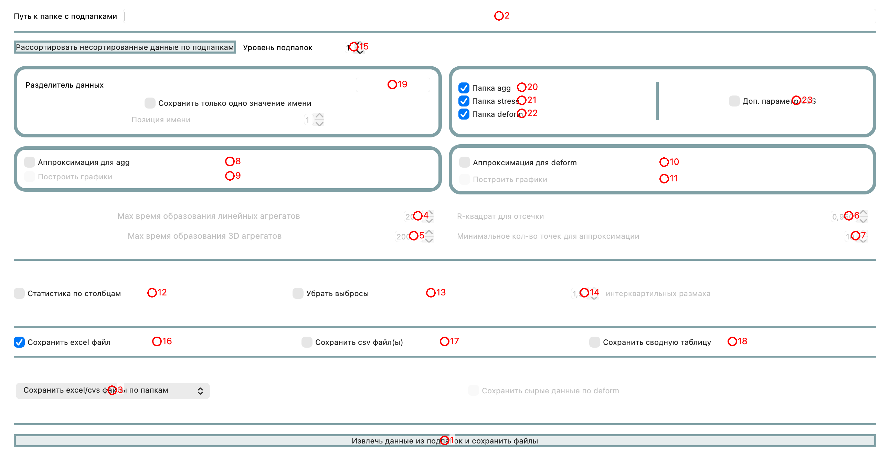
*Скриншот 1: вкладка — RheoScan*. Программа обрабатывает данные только txt файлов, полученных из RheoScan.

<b>1. btn_save_exel_csv</b> (QPushButton) 
<html><head/><body>
Произвести обработку данных исходя из введенных путей и дополнительных настроек.
</body></html>  

<b>2. main_path</b> (QLineEdit) 
<html><head/><body>
Путь к папке с подпапками с файлами RheoScan. 

В случае уровеня подпапок = 1 это должна быть папка с 3 подпапками: 

- agg

- deform

- stress

Файлы уже должны быть рассортированы. Если это не так, то выберете путь и нажмите кнопку ниже для рассортировки. 
</body></html>  

<b>3. comboBox_RheoScan_path_save</b> (QComboBox) 
<html><head/><body>
Сохранить результат обработки по всем подпапкам (в случае, если уровень подпапок &gt; 1), либо сохранить в корневой дирректории (введенный путь). Файлы excel сохранятся с теми именами, которые соответствуют папкам, в которых лежат 3 подпапки.
</body></html>  

<b>4. tua_1_agg</b> (QSpinBox) 
<html><head/><body>
Иногда надо подобрать данное значение для правильной аппроксимации агрегатограммы. 
</body></html>  

<b>5. tua_2_agg</b> (QSpinBox) 
<html><head/><body>
Иногда надо подобрать данное значение для правильной аппроксимации агрегатограммы. 
</body></html>  

<b>6. r2_def</b> (QDoubleSpinBox) 
<html><head/><body>
Иногда надо подобрать данное значение для правильной аппроксимации. 
</body></html>  

<b>7. spinBox_n_max_deform</b> (QSpinBox) 
<html><head/><body>
Иногда надо подобрать данное значение для правильной аппроксимации. 
</body></html>  

<b>8. check_approx_agg</b> (QCheckBox) 
<html><head/><body>
Произвести дополнительную аппроксимацию кривой светорассеяния для маленькой кюветы?

Аппроксимация производится с помощью 2 экспонент с разными характерными временами:
<pre style=" margin-top:0px; margin-bottom:0px; margin-left:0px; margin-right:0px; -qt-block-indent:0; text-indent:0px; background-color:#1f1f1f;"># функция, которой аппроксимируется кривая</pre><pre style=" margin-top:0px; margin-bottom:0px; margin-left:0px; margin-right:0px; -qt-block-indent:0; text-indent:0px; background-color:#1f1f1f;">def f(x, y0, A1, A2, t1, t2):</pre><pre style=" margin-top:0px; margin-bottom:0px; margin-left:0px; margin-right:0px; -qt-block-indent:0; text-indent:0px; background-color:#1f1f1f;">return y0+A1*np.exp(-(x/t1)) +A2*np.exp(-(x/t2))</pre><pre style="-qt-paragraph-type:empty; margin-top:0px; margin-bottom:0px; margin-left:0px; margin-right:0px; -qt-block-indent:0; text-indent:0px; font-family:'Menlo','Monaco','Courier New','monospace'; font-size:12px; color:#cccccc; background-color:#1f1f1f;"> </pre>
Идет расчет данных показателей, а также индекс агрегации для разных времен: 2.5, 5, 10, 50, 100 и MAX кол-ва секунд.
</body></html>  

<b>9. check_figs_for_agg</b> (QCheckBox) 
<html><head/><body>
Построить графики для аппроксимации кривых?

Рекомендуется всегда смотреть на корректность аппроксимации.
</body></html>  

<b>10. check_approx_deform</b> (QCheckBox) 
<html><head/><body>
Произвести дополнительную аппроксимацию кривой индекса деформируемости и сдвигового напряжения для большой кюветы?

Аппроксимация производится с помощью линейной функции, где напряжения приведены в логарифм:
<pre style=" margin-top:0px; margin-bottom:0px; margin-left:0px; margin-right:0px; -qt-block-indent:0; text-indent:0px; background-color:#1f1f1f;"># функция, которой будем аппроксимировать - линейная функция от логарифма напряжений сдвига</pre><pre style=" margin-top:0px; margin-bottom:0px; margin-left:0px; margin-right:0px; -qt-block-indent:0; text-indent:0px; background-color:#1f1f1f;">deff(x: float, a: float, b: float):</pre><pre style=" margin-top:0px; margin-bottom:0px; margin-left:0px; margin-right:0px; -qt-block-indent:0; text-indent:0px; background-color:#1f1f1f;">&quot;&quot;&quot;Линейная функция.&quot;&quot;&quot;</pre><pre style=" margin-top:0px; margin-bottom:0px; margin-left:0px; margin-right:0px; -qt-block-indent:0; text-indent:0px; background-color:#1f1f1f;">returna*x+b</pre>
Рассчитываются параметры предела текучести (b) и вязкости внутреклеточного содержимого (1/a).
</body></html>  

<b>11. check_for_deform</b> (QCheckBox) 
<html><head/><body>
Построить графики для аппроксимации кривых?

Рекомендуется всегда смотреть на корректность аппроксимации.
</body></html>  

<b>12. check_stat_for_column</b> (QCheckBox) 
<html><head/><body>
Создание доп. листов, где будет приведена статистика по столбцам.
</body></html>  

<b>13. vibros_delete</b> (QCheckBox) 
<html><head/><body>
Убрать выбросы. Использовать, когда вы обрабатываете только 1 пациента! 
</body></html>  

<b>14. iqr_vibros</b> (QDoubleSpinBox) 
<html><head/><body>
Коэффициент кол-ва интерквантильных размахов для определения выбросов.

Используется, только когда обрабатываете 1 пациента или 1 образец.
</body></html>  

<b>15. spinBox_level</b> (QSpinBox) 
<html><head/><body>
Уровень подпапок позволяет обрабатывать несколько папок пациентов/образцов одновременно.

К примеру, если вы ввели выше путь к папке с папками, названия которых совпадает с названием образцов, и в каждой такой папке есть 3 подпапки (agg, stress, deform), то для обновременной обработки нужно использовать уровень подпапок=2. Соответственно, чем больше у вас вложенных папок до 3 искомых подпапок, тем больше уровень подпапок вам нужно слелать.
</body></html>  

<b>16. check_save_exel</b> (QCheckBox) 
<html><head/><body>
Сохранить excel файл/файлы. Будет несколько листов в зависимости от выбранных настроек.
</body></html>  

<b>17. check_save_csv</b> (QCheckBox) 
<html><head/><body>
Сохранить csv файл/файлы. Будет несколько файлов в зависимости от выбранных настроек.
</body></html>  

<b>18. check_save_RheoScan_overall</b> (QCheckBox) 
<html><head/><body>
Сводная таблица по всем измерениям. По большей части не нужна из-за наличия доп. обработки данных RheoScan (см. 4 вкладку).
</body></html>  

<b>19. separator_for_data</b> (QLineEdit) 
<html><head/><body>
Выбрать разделитель данных. Бывает полезно для образцов.

К примеру, у вас все образцы называюся по типу &quot;sample-##-##&quot;.

Вы можете выбрать разделителем дефис &quot;-&quot; и у вас появится дополнительные стролбцы.
</body></html>  

<b>20. check_agg</b> (QCheckBox) 
<html><head/><body>
Обработать ли папку agg. Иногда требуется обработать только одну какую-то папку, а не все сразу.
</body></html>  

<b>21. check_stress</b> (QCheckBox) 
<html><head/><body>
Обработать ли папку stress. Иногда требуется обработать только одну какую-то папку, а не все сразу.
</body></html>  

<b>22. check_deform</b> (QCheckBox) 
<html><head/><body>
Обработать ли папку deform. Иногда требуется обработать только одну какую-то папку, а не все сразу.
</body></html>  

<b>23. check_dop_CSS_parameter</b> (QCheckBox) 
<html><head/><body>
Дополнительный параметр CSS, который вытаскивается из графика: светорассеяние VS напряжения сдвига. 

Идет аппроксимация экспонентной и вытаскивается параметр затухания (new_parameter).
<pre style=" margin-top:0px; margin-bottom:0px; margin-left:0px; margin-right:0px; -qt-block-indent:0; text-indent:0px; background-color:#1f1f1f;">                    (_, _, new_parameter), _=opt.curve_fit(</pre><pre style=" margin-top:0px; margin-bottom:0px; margin-left:0px; margin-right:0px; -qt-block-indent:0; text-indent:0px; background-color:#1f1f1f;">lambdat, a, b, c: a+b*np.exp(-t/c),</pre><pre style=" margin-top:0px; margin-bottom:0px; margin-left:0px; margin-right:0px; -qt-block-indent:0; text-indent:0px; background-color:#1f1f1f;">                        сдвиговое напряжение,</pre><pre style=" margin-top:0px; margin-bottom:0px; margin-left:0px; margin-right:0px; -qt-block-indent:0; text-indent:0px; background-color:#1f1f1f;">                        интенсивность обратного светорассеяния,</pre><pre style=" margin-top:0px; margin-bottom:0px; margin-left:0px; margin-right:0px; -qt-block-indent:0; text-indent:0px; background-color:#1f1f1f;">                    )</pre></body></html>  

## 2. Биола

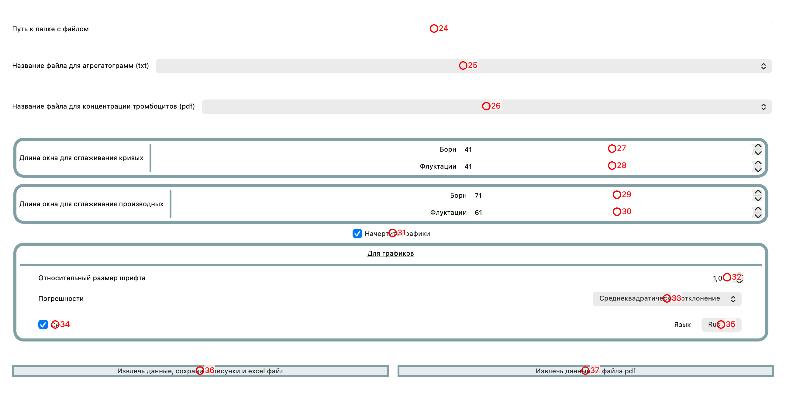
*Скриншот 2: вкладка — Биола*. Обработка данных, выгруженных из программы в txt.

<b>24. path_for_biola</b> (QLineEdit) 
<html><head/><body>
В данное поле необходимо ввести путь к папке, в которой находится txt файл с измерениями biola (борн и флуктуации) или pdf файл с измерениями концентрации тромбоцитов.
</body></html>  

<b>25. comboBox_biola</b> (QComboBox) 
<html><head/><body>
Выберете txt файл, экспортированный из программы для Биолы.

Файлы появляются автоматически при добавлении путя к папке с файлом
</body></html>  

<b>26. comboBox_biola_concentration</b> (QComboBox) 
<html><head/><body>
Выберете pdf файл с данными касательно концентрации тромбоцитов.

Файлы появляются автоматически при добавлении путя к папке с файлом
</body></html>  

<b>27. spinBox_biola_born_odd</b> (QSpinBox) 
Длина окна для сглаживания для данных светопропускания по Борну. Подбиралось эмпирически, чтобы соответствовать данным, рассчитанным в приложении Биола  

<b>28. spinBox_biola_fluc_odd</b> (QSpinBox) 
<html><head/><body>
Длина окна для сглаживания для данных флуктуаций светопропускания. Подбиралось эмпирически, чтобы соответствовать данным, рассчитанным в приложении Биола
</body></html>  

<b>29. spinBox_biola_born</b> (QSpinBox) 
<html><head/><body>
Длина окна для сглаживания для данных производной светопропускания по Борну. Подбиралось эмпирически, чтобы соответствовать данным, рассчитанным в приложении Биола
</body></html>  

<b>30. spinBox_biola_fluc</b> (QSpinBox) 
<html><head/><body>
Длина окна для сглаживания для данных производной флуктуаций светопропускания. Подбиралось эмпирически, чтобы соответствовать данным, рассчитанным в приложении Биола
</body></html>  

<b>31. check_biola_plot_figs</b> (QCheckBox) 
<html><head/><body>
Начертить ли усредненные графики по Борну и флуктуациям, а также производным?

Имеет место использовать для группы однаковых образцов или одного пациента.

 
</body></html>  

<b>32. doubleSpinBox_Biola</b> (QDoubleSpinBox) 
Относительный размер шрифта  

<b>33. comboBox_Biola_SD_or</b> (QComboBox) 
Погрешности на графиках  

<b>34. check_setka_biola</b> (QCheckBox) 
Сделать сетку на графиках?  

<b>35. comboBox_Biola_language</b> (QComboBox) 
Язык для графиков  

<b>36. btn_biola</b> (QPushButton) 
Обработать данные из txt файла  

<b>37. btn_biola_concentration</b> (QPushButton) 
Обработать данные из pdf файла  

## 3. Лазерный пинцет

*Скриншот 3: вкладка — Лазерный пинцет*. Вытаскивание значений сил из названий к видео-записям измерения сила агрегации/дезагрегации или времени агрегации.

<b>38. path_for_LT</b> (QLineEdit) 
<html><head/><body>
Необходимо в данное поле ввести путь к папке с подпапками разных концентраций/пациентов/образцов.

К примеру, в данной папке могут быть подпапки с концентрациями:

0

1

10

100

 

В каждой подпапке должны быть видео, записанные через какой-то разделитель. Сила агрегации обозначается, как FA/fa/Fa; сила дезагрегации, как FD/fd/Fd. Сила взаимодействия эритроцита и эндотелия, как End/end. Важно, чтобы первые 2 буквы имени силы было правильным. Значение силы должно быть записано без доп. Знаков (к примеру, так нельзя: «Fd3-12.2+.avi». Будут обрабатываться названия только видеофайлов. Т.е. между разделителем и «.avi» должна быть только сила. 
</body></html>  

<b>39. sep_for_LT</b> (QLineEdit) 
<html><head/><body>
Разделитель для имени подпапок. Необходим, чтобы в excel файле были выделены интерисующие имена. 

К примеру, если подпапки назывались по шаблону &quot;образец-концентрация&quot;:

dextran-0

dextran-10

dextran-100

То с разделителем &quot;-&quot; и позицией имени &quot;2&quot; в качестве образцов в excel будут: [0, 10, 100]
</body></html>  

<b>40. position</b> (QSpinBox) 
<html><head/><body>
Позиция, на которой находится имя при использовании разделителя для имени подпапок. 

К примеру, если подпапки назывались по шаблону &quot;образец-концентрация&quot;:

dextran-0

dextran-10

dextran-100

То с позицией &quot;2&quot; в качестве образцов в excel будут: [0, 10, 100]
</body></html>  

<b>41. sep_for_LT_values</b> (QLineEdit) 
<html><head/><body>
Важно внести в программу разделитель значения названия и значения силы.

К примеру, чаще всего это &quot;-&quot;. Силы записываются в этом случае для примера:

FA-19.9.avi

fa-17.0.avi

Fd-11.1.avi
</body></html>  

<b>42. comboBox_LT_calibration</b> (QComboBox) 
<html><head/><body>
Калибровка для дополнительного пучка может быть как линейной, так и экспоненциальной. Необходимо выбрать одно
</body></html>  

<b>43. btn_LT</b> (QPushButton) 
Произвести обработку данных для лазерного пинцета  

<b>44. check_LT_raw_data</b> (QCheckBox) 
Дополнительно сохранить данные в развернутом виде?   

## 4. Обработка данных

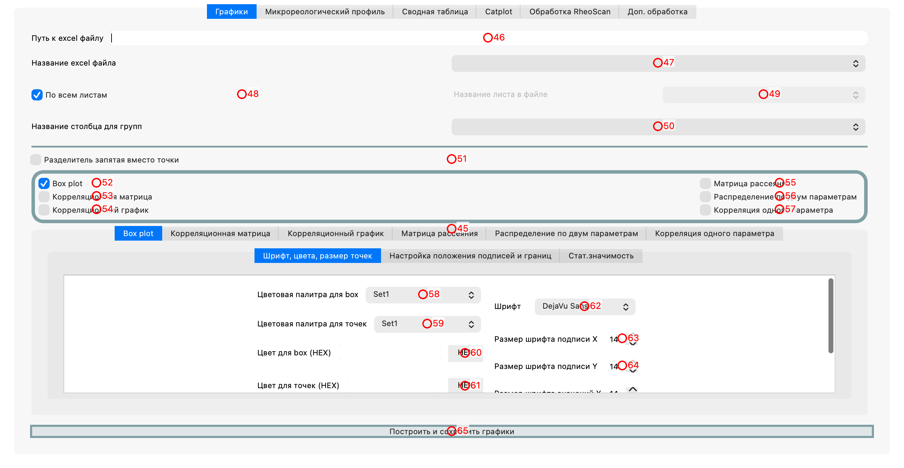
*Скриншот 4: вкладка — Обработка данных*. В данном модуле можно строить различные графики и обрабатывать данные.

<b>45. tabWidget_2</b> (QTabWidget) 
Путь к папке с excel файлом  

<b>46. path_for_plot</b> (QLineEdit) 
Путь к папке с excel файлом  

<b>47. comboBox</b> (QComboBox) 
Название excel файла -- подставится автоматически. Надо только выбрать  

<b>48. check_box_figs_all_sheets</b> (QCheckBox) 
Произвести обработку по всем листам в excel файле?  

<b>49. comboBox_figs_sheets</b> (QComboBox) 
Название листа в excel файле -- подставится автоматически. Надо только выбрать  

<b>50. comboBox_2</b> (QComboBox) 
<html><head/><body>
Название столбца для категориальных групп.

Это может быть любая колонка, где есть определенные категории.

К примеру, &quot;Пол&quot;.
</body></html>  

<b>51. checkBox_point_comma_separator</b> (QCheckBox) 
Разделитель значений на графике запятая?  

<b>52. check_box_plot</b> (QCheckBox) 
<html><head/><body>
Построить график box plot, в котором представлены разные категории?

В отдельной вкладке внизу можно изменить некоторые настройки построения графика.
</body></html>  

<b>53. check_corr_matrix</b> (QCheckBox) 
<html><head/><body>
Построить график корреляционной матрицы? Одна матрица на каждую категорию.

В отдельной вкладке внизу можно изменить некоторые настройки построения графика.
</body></html>  

<b>54. check_corr_figs</b> (QCheckBox) 
<html><head/><body>
Построить корреляционный график, где цветами будут выделены категории?

В отдельной вкладке внизу можно изменить некоторые настройки построения графика.
</body></html>  

<b>55. check_box_pairplot</b> (QCheckBox) 
<html><head/><body>
Построить матрицу рассеяния, где цветами будут выделены категории?

В отдельной вкладке внизу можно изменить некоторые настройки построения графика.
</body></html>  

<b>56. check_jointplot</b> (QCheckBox) 
<html><head/><body>
Построить график распределение по двум параметрам?

В отдельной вкладке внизу можно изменить некоторые настройки построения графика.
</body></html>  

<b>57. check_corr_one_parameter</b> (QCheckBox) 
<html><head/><body>
Построить корреляцию одного параметра? 

То есть строится корреляция между выбранной колонки и всеми остальными.

Строится отдельно от других графиков. 

В отдельной вкладке внизу можно изменить некоторые настройки построения графика.
</body></html>  

<b>58. comboBox_color_pal_box</b> (QComboBox) 
<html><head/><body>
Цветовая палитра для box
</body></html>  

<b>59. comboBox_color_pal_points</b> (QComboBox) 
<html><head/><body>
Цветовая палитра для точек
</body></html>  

<b>60. pushButton_HEX_box</b> (QPushButton) 
<html><head/><body>
Возможно делать кастомные цвета для box.

Для этого выберайте итерационно цвета в палитре.

В панеле слева будет формироваться строка, которая будет использована для создания палитры.
</body></html>  

<b>61. pushButton_HEX_points</b> (QPushButton) 
<html><head/><body>
Возможно делать кастомные цвета для точек.

Для этого выберайте итерационно цвета в палитре.

В панеле слева будет формироваться строка, которая будет использована для создания палитры.
</body></html>  

<b>62. comboBox_fonts</b> (QComboBox) 
Шрифт для подписей на графиках  

<b>63. spinBox_x_label</b> (QSpinBox) 
Размер шрифта подписи X  

<b>64. spinBox_y_label</b> (QSpinBox) 
Размер шрифта подписи Y  

<b>65. btn_plot_and_save_figs</b> (QPushButton) 
Построить все графики и сохранить их в соответствующих папках  

### 4.1. Графики

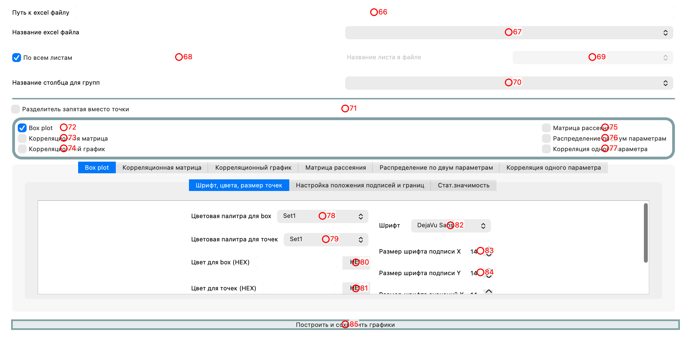
*Скриншот 4.1: вкладка — Графики*. Построение разных графиков. Используется только данные в 'длинном' формате.

<b>66. path_for_plot</b> (QLineEdit) 
Путь к папке с excel файлом  

<b>67. comboBox</b> (QComboBox) 
Название excel файла -- подставится автоматически. Надо только выбрать  

<b>68. check_box_figs_all_sheets</b> (QCheckBox) 
Произвести обработку по всем листам в excel файле?  

<b>69. comboBox_figs_sheets</b> (QComboBox) 
Название листа в excel файле -- подставится автоматически. Надо только выбрать  

<b>70. comboBox_2</b> (QComboBox) 
<html><head/><body>
Название столбца для категориальных групп.

Это может быть любая колонка, где есть определенные категории.

К примеру, &quot;Пол&quot;.
</body></html>  

<b>71. checkBox_point_comma_separator</b> (QCheckBox) 
Разделитель значений на графике запятая?  

<b>72. check_box_plot</b> (QCheckBox) 
<html><head/><body>
Построить график box plot, в котором представлены разные категории?

В отдельной вкладке внизу можно изменить некоторые настройки построения графика.
</body></html>  

<b>73. check_corr_matrix</b> (QCheckBox) 
<html><head/><body>
Построить график корреляционной матрицы? Одна матрица на каждую категорию.

В отдельной вкладке внизу можно изменить некоторые настройки построения графика.
</body></html>  

<b>74. check_corr_figs</b> (QCheckBox) 
<html><head/><body>
Построить корреляционный график, где цветами будут выделены категории?

В отдельной вкладке внизу можно изменить некоторые настройки построения графика.
</body></html>  

<b>75. check_box_pairplot</b> (QCheckBox) 
<html><head/><body>
Построить матрицу рассеяния, где цветами будут выделены категории?

В отдельной вкладке внизу можно изменить некоторые настройки построения графика.
</body></html>  

<b>76. check_jointplot</b> (QCheckBox) 
<html><head/><body>
Построить график распределение по двум параметрам?

В отдельной вкладке внизу можно изменить некоторые настройки построения графика.
</body></html>  

<b>77. check_corr_one_parameter</b> (QCheckBox) 
<html><head/><body>
Построить корреляцию одного параметра? 

То есть строится корреляция между выбранной колонки и всеми остальными.

Строится отдельно от других графиков. 

В отдельной вкладке внизу можно изменить некоторые настройки построения графика.
</body></html>  

<b>78. comboBox_color_pal_box</b> (QComboBox) 
<html><head/><body>
Цветовая палитра для box
</body></html>  

<b>79. comboBox_color_pal_points</b> (QComboBox) 
<html><head/><body>
Цветовая палитра для точек
</body></html>  

<b>80. pushButton_HEX_box</b> (QPushButton) 
<html><head/><body>
Возможно делать кастомные цвета для box.

Для этого выберайте итерационно цвета в палитре.

В панеле слева будет формироваться строка, которая будет использована для создания палитры.
</body></html>  

<b>81. pushButton_HEX_points</b> (QPushButton) 
<html><head/><body>
Возможно делать кастомные цвета для точек.

Для этого выберайте итерационно цвета в палитре.

В панеле слева будет формироваться строка, которая будет использована для создания палитры.
</body></html>  

<b>82. comboBox_fonts</b> (QComboBox) 
Шрифт для подписей на графиках  

<b>83. spinBox_x_label</b> (QSpinBox) 
Размер шрифта подписи X  

<b>84. spinBox_y_label</b> (QSpinBox) 
Размер шрифта подписи Y  

<b>85. btn_plot_and_save_figs</b> (QPushButton) 
Построить все графики и сохранить их в соответствующих папках  

#### 4.1.1. Box plot

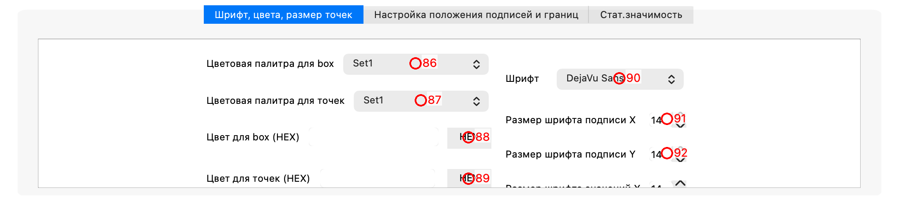
*Скриншот 4.1.1: вкладка — Box plot*. Построение box-plot.

<b>86. comboBox_color_pal_box</b> (QComboBox) 
<html><head/><body>
Цветовая палитра для box
</body></html>  

<b>87. comboBox_color_pal_points</b> (QComboBox) 
<html><head/><body>
Цветовая палитра для точек
</body></html>  

<b>88. pushButton_HEX_box</b> (QPushButton) 
<html><head/><body>
Возможно делать кастомные цвета для box.

Для этого выберайте итерационно цвета в палитре.

В панеле слева будет формироваться строка, которая будет использована для создания палитры.
</body></html>  

<b>89. pushButton_HEX_points</b> (QPushButton) 
<html><head/><body>
Возможно делать кастомные цвета для точек.

Для этого выберайте итерационно цвета в палитре.

В панеле слева будет формироваться строка, которая будет использована для создания палитры.
</body></html>  

<b>90. comboBox_fonts</b> (QComboBox) 
Шрифт для подписей на графиках  

<b>91. spinBox_x_label</b> (QSpinBox) 
Размер шрифта подписи X  

<b>92. spinBox_y_label</b> (QSpinBox) 
Размер шрифта подписи Y  

##### 4.1.1.1. Шрифт, цвета, размер точек

*Скриншот 4.1.1.1: вкладка — Шрифт, цвета, размер точек*. 

<b>93. comboBox_color_pal_box</b> (QComboBox) 
<html><head/><body>
Цветовая палитра для box
</body></html>  

<b>94. comboBox_color_pal_points</b> (QComboBox) 
<html><head/><body>
Цветовая палитра для точек
</body></html>  

<b>95. pushButton_HEX_box</b> (QPushButton) 
<html><head/><body>
Возможно делать кастомные цвета для box.

Для этого выберайте итерационно цвета в палитре.

В панеле слева будет формироваться строка, которая будет использована для создания палитры.
</body></html>  

<b>96. pushButton_HEX_points</b> (QPushButton) 
<html><head/><body>
Возможно делать кастомные цвета для точек.

Для этого выберайте итерационно цвета в палитре.

В панеле слева будет формироваться строка, которая будет использована для создания палитры.
</body></html>  

<b>97. comboBox_fonts</b> (QComboBox) 
Шрифт для подписей на графиках  

<b>98. spinBox_x_label</b> (QSpinBox) 
Размер шрифта подписи X  

<b>99. spinBox_y_label</b> (QSpinBox) 
Размер шрифта подписи Y  

##### 4.1.1.2. Настройка положения подписей и границ

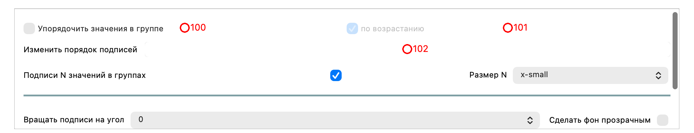
*Скриншот 4.1.1.2: вкладка — Настройка положения подписей и границ*. 

<b>100. check_sort_or_not</b> (QCheckBox) 
Упорядочить значения в группе? Используется базовая сортировка  

<b>101. check_sort_or_not_ascending</b> (QCheckBox) 
Упорядочить значения в группе по возрастанию?  

<b>102. order_box_plot</b> (QLineEdit) 
<html><head/><body>
Изменить порядок подписей. 

Для этого необходимо через пробел цифрами ввести настоящий порядок.

Важно, чтобы количество элементов соответствовало кол-ву категорий в группе.

К примеру, можно ввести следующее:

1 2 4 3

Тогда будет порядок, как он представлен выше относительно начального порядка без упорядочивания
</body></html>  

##### 4.1.1.3. Стат.значимость

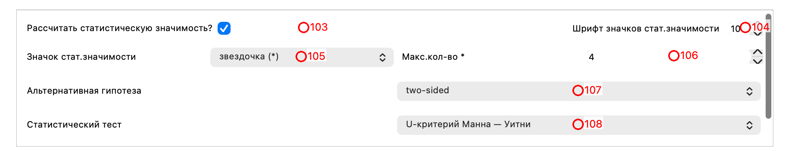
*Скриншот 4.1.1.3: вкладка — Стат.значимость*. 

<b>103. check_stat_znachimost</b> (QCheckBox) 
Рассчитать статистическую значимость?  

<b>104. spinBox_size_stat_znachimost</b> (QSpinBox) 
Шрифт значков статистической значимости  

<b>105. comboBox_box_plot_sign_stat_znachimost</b> (QComboBox) 
<html><head/><body>
Значок статистической значимости.

Один из трех:

- звездочка (*)

- точное значение p (p=0.03)

- относительное p (p&lt;0.05)

Статистическая значимость для здездочек обозначается следующим:

* p&lt;0.05, ** p&lt;0.01, *** p&lt;0.001, **** p&lt;0.0001
</body></html>  

<b>106. spinBox_max_n_stars</b> (QSpinBox) 
<html><head/><body>
Максимальное кол-во знаков для статистической значимости.

Работает для значка стат.значимости &quot;звездочка&quot; и &quot;точное значение p&quot;.

Если макс.кол-во знаков = 1, то будет выведены только:

* или p&lt;0.05, даже если p=0.00001
</body></html>  

<b>107. comboBox_alter_hep</b> (QComboBox) 
<html><head/><body>
Альтернативная гипотеза для теста.

Если не знаете, то используйте всегда two-sided
</body></html>  

<b>108. comboBox_stat_test</b> (QComboBox) 
<html><head/><body>
Статистический тест для расчета стат.значимости. 

В списке есть как параметрические, так и непараметрические тесты.
</body></html>  

#### 4.1.2. Корреляционная матрица

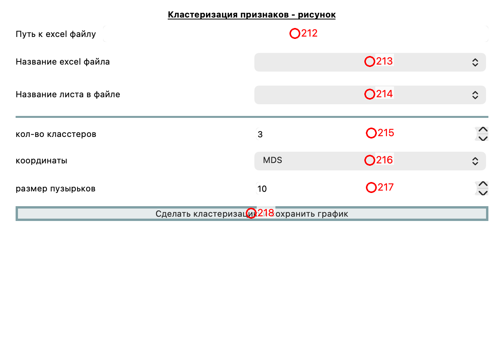
*Скриншот 4.1.2: вкладка — Корреляционная матрица*. 

<b>109. comboBox_correlation_figs_matrix</b> (QComboBox) 
<html><head/><body>
Метод расчета корреляций: Пирсон, Спирмен или Кендал.
</body></html>  

<b>110. comboBox_correlation_color_map_for_figs</b> (QComboBox) 
Цветовая схема для корреляционной матрицы.  

<b>111. corr_mat_figsize</b> (QDoubleSpinBox) 
<html><head/><body>
Размер рисунка для корреляционной матрицы. 

Подбирается вручную. Влияет на размер конечного файла.
</body></html>  

<b>112. font_for_in</b> (QDoubleSpinBox) 
<html><head/><body>
Масштаб шрифта подписей для корреляционных матриц.

Подбирается вручную.
</body></html>  

<b>113. font_for_out</b> (QDoubleSpinBox) 
Размер шрифта заголовка. Подбирается вручную.  

<b>114. name_of_corr_matrix</b> (QLineEdit) 
<html><head/><body>
Дополнительное название заголовка &lt;title&gt;. 

Конечное название формулируется следующим образом:

&lt;title&gt; + название_категории + (N=&lt;кол-во образцов&gt;)
</body></html>  

#### 4.1.3. Корреляционный график

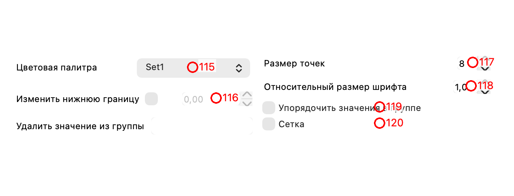
*Скриншот 4.1.3: вкладка — Корреляционный график*. 

<b>115. comboBox_color_pal_corr</b> (QComboBox) 
Цветовая палитра для корреляционного графика.  

<b>116. doubleSpinBox_corr_figs</b> (QDoubleSpinBox) 
Нижняя граница для корреляционного графика. Иногда полезно, если нужно сделать четко "0" или другое число.  

<b>117. spinBox_points_corrFIGS</b> (QSpinBox) 
Размер точек для корреляционного графика.  

<b>118. doubleSpinBox_corr_figs_fontscale</b> (QDoubleSpinBox) 
Относительный размер шрифта для графика.  

<b>119. check_sort_or_not_corr_figs</b> (QCheckBox) 
Сортировать значения в группе?  

<b>120. check_setka</b> (QCheckBox) 
Включить сетку?  

#### 4.1.4. Матрица рассеяния

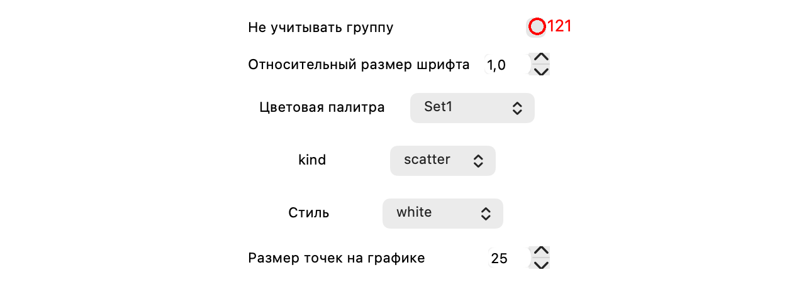
*Скриншот 4.1.4: вкладка — Матрица рассеяния*. 

<b>121. check_pairplot</b> (QCheckBox) 
<html><head/><body>
Не учитвать группу в матрице рассеяния? 

В этом случае все категории будут объеденены.
</body></html>  

#### 4.1.5. Распределение по двум параметрам

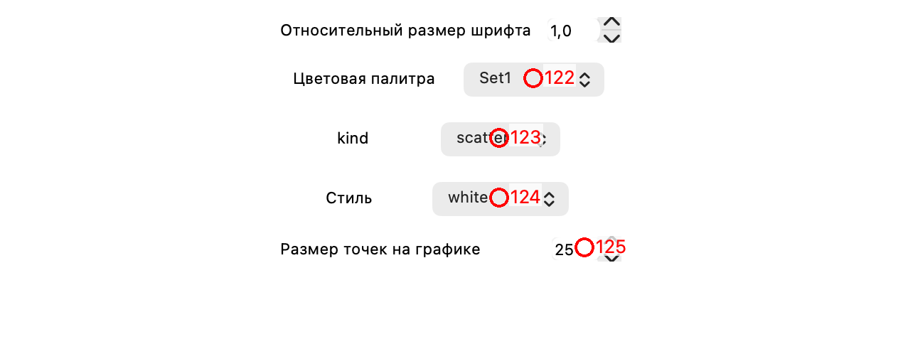
*Скриншот 4.1.5: вкладка — Распределение по двум параметрам*. 

<b>122. comboBox_color_jointplot</b> (QComboBox) 
Цветовая палитра для графика распределение по двум параметрам.  

<b>123. comboBox_pairplot_jointplot</b> (QComboBox) 
Возможные настройки по отображению распределений.  

<b>124. comboBox_style_jointplot</b> (QComboBox) 
Стиль графика. Используются стили seaborn.  

<b>125. spinBox_point_size_for_jointplot</b> (QSpinBox) 
Размер точек на графике.  

#### 4.1.6. Корреляция одного параметра

*Скриншот 4.1.6: вкладка — Корреляция одного параметра*. 

<b>126. comboBox_correlation_one_parameter</b> (QComboBox) 
Метод расчета корреляций: Пирсон, Спирмен или Кендал.  

<b>127. doubleSpinBox_size_for_one_correlation</b> (QDoubleSpinBox) 
Относительный размер шрифта для корреляции одного параметра.  

<b>128. doubleSpinBox_one_correlation</b> (QDoubleSpinBox) 
Отсечка по корреляциям. Все корреляции, которые ниже заданного числа, не будут учитываться.  

<b>129. check_corr_one_parameter_plot_sep_wind</b> (QCheckBox) 
<html><head/><body>
Построить график в отдельном окне?

Используйте, только если запускаете приложение не через десктопную версию.
</body></html>  

### 4.2. Микрореологический профиль

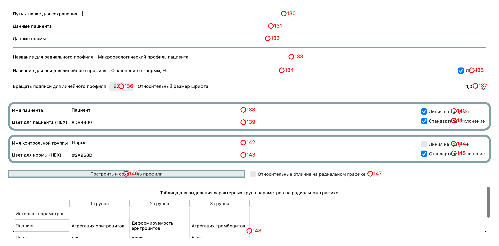
*Скриншот 4.2: вкладка — Микрореологический профиль*. 

<b>130. path_for_profile</b> (QLineEdit) 
Путь к папке, в которую будут сохранены микрореологические профили.  

<b>131. patient_data</b> (QLineEdit) 
<html><head/><body>
Данные пациента.

Должны быть скопированы из excel и вставлены в данную ячейку.

Должно быть скопировано 3 столбца, к примеру:

 
<table border="0" style=" margin-top:0px; margin-bottom:0px; margin-left:0px; margin-right:0px; border-collapse:collapse;" cellspacing="2" cellpadding="0"><thead><tr><td style=" padding-left:0; padding-right:16; padding-top:10; padding-bottom:10; border-top:7px; border-bottom:1px; border-top-color:#000000; border-bottom-style:solid;">
Параметр
</td><td style=" padding-left:16; padding-right:16; padding-top:10; padding-bottom:10; border-top:7px; border-bottom:1px; border-top-color:#000000; border-bottom-style:solid;">
Среднее
</td><td style=" padding-left:16; padding-right:16; padding-top:10; padding-bottom:10; border-top:7px; border-bottom:1px; border-top-color:#000000; border-bottom-style:solid;">
SD
</td></tr></thead><tr><td style=" padding-left:0; padding-right:16; padding-top:10; padding-bottom:10; border-bottom:1px; border-bottom-style:solid;">
CSS, мПа
</td><td style=" padding-left:16; padding-right:16; padding-top:10; padding-bottom:10; border-bottom:1px; border-bottom-style:solid;">
300
</td><td style=" padding-left:16; padding-right:0; padding-top:10; padding-bottom:10; border-bottom:1px; border-bottom-style:solid;">
15
</td></tr><tr><td style=" padding-left:0; padding-right:16; padding-top:10; padding-bottom:10; border-bottom:1px; border-bottom-style:solid;">
AI, %
</td><td style=" padding-left:16; padding-right:16; padding-top:10; padding-bottom:10; border-bottom:1px; border-bottom-style:solid;">
62
</td><td style=" padding-left:16; padding-right:0; padding-top:10; padding-bottom:10; border-bottom:1px; border-bottom-style:solid;">
5
</td></tr><tr><td style=" padding-left:0; padding-right:16; padding-top:10; padding-bottom:10; border-bottom:1px; border-bottom-style:solid;">
AMP
</td><td style=" padding-left:16; padding-right:16; padding-top:10; padding-bottom:10; border-bottom:1px; border-bottom-style:solid;">
0,06
</td><td style=" padding-left:16; padding-right:0; padding-top:10; padding-bottom:10; border-bottom:1px; border-bottom-style:solid;">
0.01
</td></tr></table>
 

Параметры должны обязательно называться одинаково для нормы и пациента.

Называться параметры могут произвольно. Latex поддерживается.
</body></html>  

<b>132. norm_data</b> (QLineEdit) 
<html><head/><body>
Данные нормы.

Должны быть скопированы из excel и вставлены в данную ячейку.

Должно быть скопировано 3 столбца, к примеру:

 
<table border="0" style=" margin-top:0px; margin-bottom:0px; margin-left:0px; margin-right:0px; border-collapse:collapse;" cellspacing="2" cellpadding="0"><thead><tr><td style=" padding-left:0; padding-right:16; padding-top:10; padding-bottom:10; border-top:7px; border-bottom:1px; border-top-color:#000000; border-bottom-color:#000000; border-bottom-style:solid;">
Параметр
</td><td style=" padding-left:16; padding-right:16; padding-top:10; padding-bottom:10; border-top:7px; border-bottom:1px; border-top-color:#000000; border-bottom-color:#000000; border-bottom-style:solid;">
Среднее
</td><td style=" padding-left:16; padding-right:16; padding-top:10; padding-bottom:10; border-top:7px; border-bottom:1px; border-top-color:#000000; border-bottom-color:#000000; border-bottom-style:solid;">
SD
</td></tr></thead><tr><td style=" padding-left:0; padding-right:16; padding-top:10; padding-bottom:10; border-bottom:1px; border-bottom-color:#000000; border-bottom-style:solid;">
CSS, мПа
</td><td style=" padding-left:16; padding-right:16; padding-top:10; padding-bottom:10; border-bottom:1px; border-bottom-color:#000000; border-bottom-style:solid;">
300
</td><td style=" padding-left:16; padding-right:0; padding-top:10; padding-bottom:10; border-bottom:1px; border-bottom-color:#000000; border-bottom-style:solid;">
15
</td></tr><tr><td style=" padding-left:0; padding-right:16; padding-top:10; padding-bottom:10; border-bottom:1px; border-bottom-color:#000000; border-bottom-style:solid;">
AI, %
</td><td style=" padding-left:16; padding-right:16; padding-top:10; padding-bottom:10; border-bottom:1px; border-bottom-color:#000000; border-bottom-style:solid;">
62
</td><td style=" padding-left:16; padding-right:0; padding-top:10; padding-bottom:10; border-bottom:1px; border-bottom-color:#000000; border-bottom-style:solid;">
5
</td></tr><tr><td style=" padding-left:0; padding-right:16; padding-top:10; padding-bottom:10; border-bottom:1px; border-bottom-color:#000000; border-bottom-style:solid;">
AMP
</td><td style=" padding-left:16; padding-right:16; padding-top:10; padding-bottom:10; border-bottom:1px; border-bottom-color:#000000; border-bottom-style:solid;">
0,06
</td><td style=" padding-left:16; padding-right:0; padding-top:10; padding-bottom:10; border-bottom:1px; border-bottom-color:#000000; border-bottom-style:solid;">
0.01
</td></tr></table>
 

Параметры должны обязательно называться одинаково для нормы и пациента.

Называться параметры могут произвольно. Latex поддерживается.
</body></html>  

<b>133. profile_title_rad</b> (QLineEdit) 
<html><head/><body>
Название для радиального профиля.
</body></html>  

<b>134. profile_title_lin</b> (QLineEdit) 
Название для оси для линейного профиля.  

<b>135. check_profile_legend</b> (QCheckBox) 
Вставить легенду?  

<b>136. comboBox_profile_lin_spin</b> (QComboBox) 
Вращать подписи для линейного профиля?  

<b>137. doubleSpinBoX_profile</b> (QDoubleSpinBox) 
Относительный размер шрифта на графиках.  

<b>138. patient_prof</b> (QLineEdit) 
Имя пациента/образца.  

<b>139. color_for_patient</b> (QLineEdit) 
Цвет для пациента. Используются только цвета HEX.  

<b>140. check_profile_pat_line</b> (QCheckBox) 
Пациент -- добавить линию на графике.  

<b>141. check_profile_pat_sd</b> (QCheckBox) 
Пациент -- добавить область с стандартным отклонением на графике.  

<b>142. norm_prof</b> (QLineEdit) 
Имя для нормы.  

<b>143. color_for_norm</b> (QLineEdit) 
Цвет для нормы. Используются только цвета HEX.  

<b>144. check_profile_norm_line</b> (QCheckBox) 
Норма -- добавить линию на графике.  

<b>145. check_profile_norm_sd</b> (QCheckBox) 
Норма -- добавить область с стандартным отклонением на графике.  

<b>146. btn_plot_and_save_profile</b> (QPushButton) 
Построить и сохранить радиальный и линейный профили.  

<b>147. check_profile_relative</b> (QCheckBox) 
Добавить значения относительных различий на радиальном графике?  

<b>148. tableWidget</b> (QTableWidget) 
<html><head/><body>
Интервал параметров нужно писать через тире. Индекс начинается с нуля, а не единицы.

Пример: если всего 8 параметров, то можно сделать так:

(1 группа) &quot;0-3&quot;

(2 группа) &quot;4-5&quot;

(3 группа) &quot;6-7&quot;

Цвета: matplotlib.colors

Стиль линии: см. matplotlib 

solid, dashed, dashdot, dotted 
</body></html>  

### 4.3. Сводная таблица

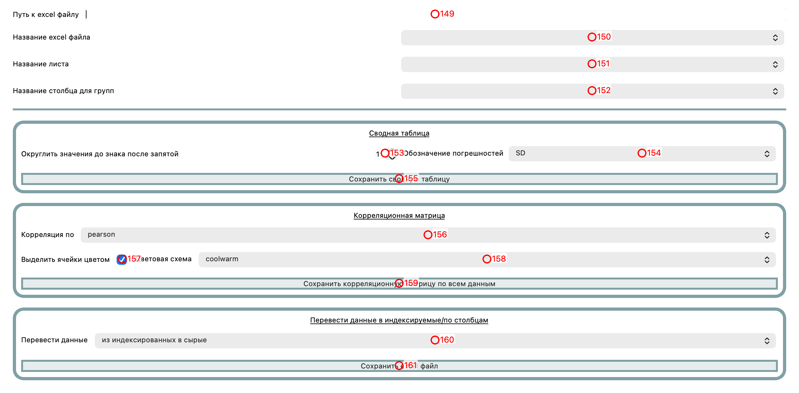
*Скриншот 4.3: вкладка — Сводная таблица*. 

<b>149. path_for_pivot_table</b> (QLineEdit) 
Путь к папке, где лежит(ат) excel файл(ы) для сводных таблиц.  

<b>150. comboBox_pivot_table</b> (QComboBox) 
Название excel файла -- подставится автоматически. Надо только выбрать  

<b>151. comboBox_pivot_table_excel_sheet</b> (QComboBox) 
Название листа в excel файле -- подставится автоматически. Надо только выбрать  

<b>152. comboBox_pivot_hue</b> (QComboBox) 
Выберете столбец для групп. Это категориальная группа. К примеру, "Пол".  

<b>153. spinBox_pivot_table</b> (QSpinBox) 
Округлить значения до выбранного знака после запятой.  

<b>154. comboBox_sd_or_se_pivot</b> (QComboBox) 
Погрешность SD или SE.  

<b>155. btn_plot_and_save_pivot_table</b> (QPushButton) 
Получить и сохранить сводную таблицу.  

<b>156. comboBox_correlation_person_or_not</b> (QComboBox) 
<html><head/><body>
Метод расчета корреляций: Пирсон, Спирмен или Кендал.
</body></html>  

<b>157. check_color_for_corr_pivot</b> (QCheckBox) 
Выделить ячейки цветом?  

<b>158. comboBox_correlation_color_map</b> (QComboBox) 
Цветовая схема для корреляционной матрицы?  

<b>159. btn_plot_and_save_corr_table</b> (QPushButton) 
<html><head/><body>
Получить и сохранить корреляционную матрицу по всем данным.

Используются все столбцы для анализа.
</body></html>  

<b>160. comboBox_index_data_or_raw</b> (QComboBox) 
<html><head/><body>
Перевести таблицу из широкого к длинному формату или наоборот.

Под индексируемыми полагается -- длинный формат.

Под сырым -- широкий формат.
</body></html>  

<b>161. btn_save_pivot_or_melt</b> (QPushButton) 
<html><head/><body>
Перевести данные из широкого в длинный формат или наоборот и сохранить excel файл.
</body></html>  

### 4.4. Catplot

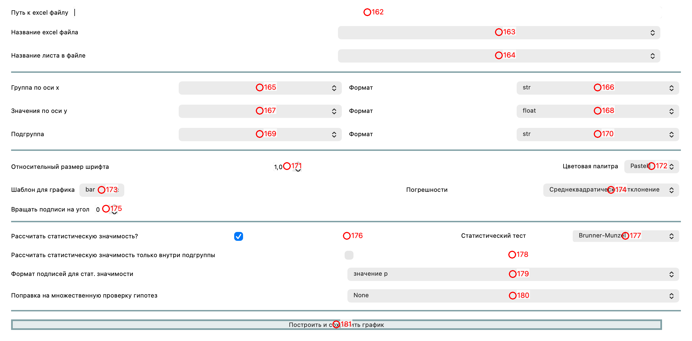
*Скриншот 4.4: вкладка — Catplot*. Построение графика catplot. Используется только данные в 'длинном' формате.

<b>162. path_for_catplot</b> (QLineEdit) 
Путь к папке с excel файлом  

<b>163. comboBox_excel_catplot</b> (QComboBox) 
Название excel файла -- подставится автоматически. Надо только выбрать  

<b>164. comboBox_excel_sheet_catplot</b> (QComboBox) 
Название листа в excel файле -- подставится автоматически. Надо только выбрать  

<b>165. comboBox_catplot_x</b> (QComboBox) 
<html><head/><body>
Основная группа, в которой представлены категории.

К примеру, группа &quot;Диагноз&quot;.
</body></html>  

<b>166. comboBox_catplot_form_x</b> (QComboBox) 
<html><head/><body>
Явно привести тип для группы по оси X в заданный тип.
</body></html>  

<b>167. comboBox_catplot_y</b> (QComboBox) 
<html><head/><body>
Таргетный параметры для вывода на ось Y.

К примеру, &quot;Сила агрегации&quot;. 

Обычно подразумевается, что значения в данном параметре:

- float

- int

 То есть непрерывные или дискретные.
</body></html>  

<b>168. comboBox_catplot_form_y</b> (QComboBox) 
<html><head/><body>
Явно привести тип для значений по оси Y в заданный тип.
</body></html>  

<b>169. comboBox_catplot_hue</b> (QComboBox) 
<html><head/><body>
Дополнительная подгруппа в группе.

К примеру, группа может быть &quot;Диагноз&quot;, а подгруппа &quot;Пол&quot;.

На графике будут всевозможные комбинации категорий из двух групп.
</body></html>  

<b>170. comboBox_catplot_form_hue</b> (QComboBox) 
<html><head/><body>
Явно привести тип для подгруппы в заданный тип.
</body></html>  

<b>171. doubleSpinBox_catplot</b> (QDoubleSpinBox) 
Относительный размер шрифта.  

<b>172. comboBox_color_catplot</b> (QComboBox) 
Цветовая палитра для catplot.  

<b>173. comboBox_template_catplot</b> (QComboBox) 
<html><head/><body>
Шаблон для графика:

1. strip - точечный график, показывает все точки данных с легким разбросом по горизонтали чтобы избежать перекрытия

2. swarm - точечный график без перекрытия, точки располагаются плотно, сохраняя положение по оси Y

3. box - боксплот, показывает медиану, квартили, выбросы и разброс данных

4. violin - график плотности, показывает распределение данных и его форму

5. boxen - улучшенный боксплот для больших наборов данных, показывает больше квантилей

6. point - график со средними значениями и доверительными интервалами, соединяет точки линиями

7. bar - столбчатая диаграмма со средними значениями и доверительными интервалами
</body></html>  

<b>174. comboBox_catplot_SD_or_not</b> (QComboBox) 
Погрешности для вывода: SD, SE, доверительный или перцентильный интервал.  

<b>175. spinBox_catplot_angle</b> (QSpinBox) 
Вращать подписи на заданный угол.  

<b>176. check_stat_znachimost_catplot</b> (QCheckBox) 
Рассчитать статистическую значимость?  

<b>177. comboBox_stat_test_catplot</b> (QComboBox) 
Статистический тест для расчета статистической значимости для catplot.  

<b>178. check_stat_znachimost_catplot_inside_subgroup</b> (QCheckBox) 
Рассчитать статистическую значимость только внутри подгруппы?  

<b>179. comboBox_catplot_stat_formatt</b> (QComboBox) 
<html><head/><body>
Формат подписей для стат. значимости:

Один из трех:

- звездочка (*)

- точное значение p (p=0.03)

- относительное p (p&lt;0.05)

Статистическая значимость для здездочек обозначается следующим:

* p&lt;0.05, ** p&lt;0.01, *** p&lt;0.001, **** p&lt;0.0001

Данная расшифровка сохраняется в txt файл рядом с рисунком.
</body></html>  

<b>180. comboBox_catplot_mult_stat</b> (QComboBox) 
<html><head/><body>
Поправка на множественную проверку гипотез. Важно когда много попарных сравнений.
</body></html>  

<b>181. btn_plot_and_save_catplot</b> (QPushButton) 
Построить график catplot и сохранить png файл.  

### 4.5. Обработка RheoScan

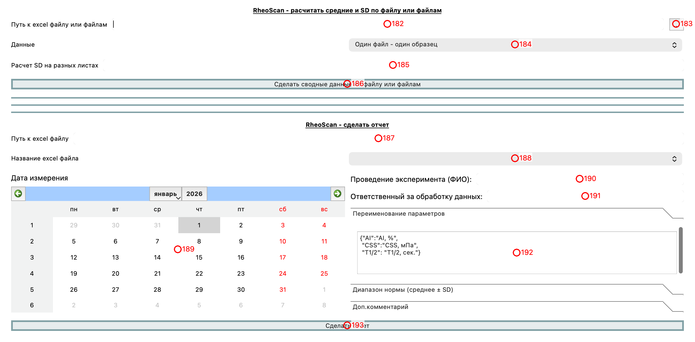
*Скриншот 4.5: вкладка — Обработка RheoScan*. Доп. обработка данных, полученных с помощью данной программы.

<b>182. path_for_RheoScan_describe</b> (QLineEdit) 
<html><head/><body>
Путь папке к excel файлу или файлам, которые были получены путем расчета из первой вкладки.

Важно, что будут рассмотрены все excel файлы из папки.
</body></html>  

<b>183. toolButton_RheoScan</b> (QToolButton) 
<html><head/><body>
Выбрать папку, в которой лежат excel файлы интерактивно.
</body></html>  

<b>184. comboBox_RheoScan_describe</b> (QComboBox) 
<html><head/><body>
Можно выбрать следующее: 

1. Либо у вас есть много файлов, где каждый файл -- это измерения по одному образцу/пациенту.

2. Либо у вас один файл, где первая колонка соответствует названию образца или ФИО пациента. Важно, чтобы это была первая колонка.
</body></html>  

<b>185. RheoScan_describe_mask_sheets</b> (QLineEdit) 
<html><head/><body>
Возможность расчета/игнорирование SD на разных листах.

По дефолту SD расчитывается для всех листов excel.

По сути это маска, которая должна состоять из:

положительных -- оставить SD  -- (&quot;y&quot;, &quot;yes&quot;, &quot;t&quot;, &quot;true&quot;, &quot;on&quot;, &quot;1&quot;)

или

отрицательных -- убрать SD -- (&quot;n&quot;, &quot;no&quot;, &quot;f&quot;, &quot;false&quot;, &quot;off&quot;, &quot;0&quot;)

К примеру, если у вас 3 листа и нужно только для первых двух посчитать SD, а для третьего -- НЕТ, то нужно ввести:

&quot;1 1 0&quot; -- ввести без кавычек.
</body></html>  

<b>186. btn_RheoScan_describe_file_or_files</b> (QPushButton) 
<html><head/><body>
Рассчитать средние значения и SD для файла или файлов и сохранить данные в excel файл.
</body></html>  

<b>187. path_for_rheoscan_report</b> (QLineEdit) 
Путь к папке с excel файлом  

<b>188. comboBox_rheoscan_report</b> (QComboBox) 
Название excel файла -- подставится автоматически. Надо только выбрать  

<b>189. calendarWidget_rheoscan_report</b> (QCalendarWidget) 
Дата измерения.  

<b>190. rheoscan_report_name_exp</b> (QLineEdit) 
<html><head/><body>
ФИО того, кто проводил эксперимент.
</body></html>  

<b>191. rheoscan_report_name_process</b> (QLineEdit) 
<html><head/><body>
ФИО того, кто обрабатывал данные.
</body></html>  

<b>192. rheoscan_report_parameters_dict</b> (QPlainTextEdit) 
<html><head/><body>
Здесь нужно в виде Python словаря ввести переименование параметров.

К примеру, в excel файле параметр индекса агрегации называется &quot;AI&quot;, а в отчете мы хотим видеть &quot;AI, %&quot;.

К примеру:

{&quot;AI&quot;:&quot;AI, %&quot;, &quot;CSS&quot;:&quot;CSS, мПа&quot;, &quot;T1/2&quot;: &quot;T1/2, сек.&quot;}
</body></html>  

<b>193. btn_make_rheoscan_report</b> (QPushButton) 
Сделать отчет по одному образцу/пациенту и сохранить его в pdf.  

### 4.6. Доп. обработка

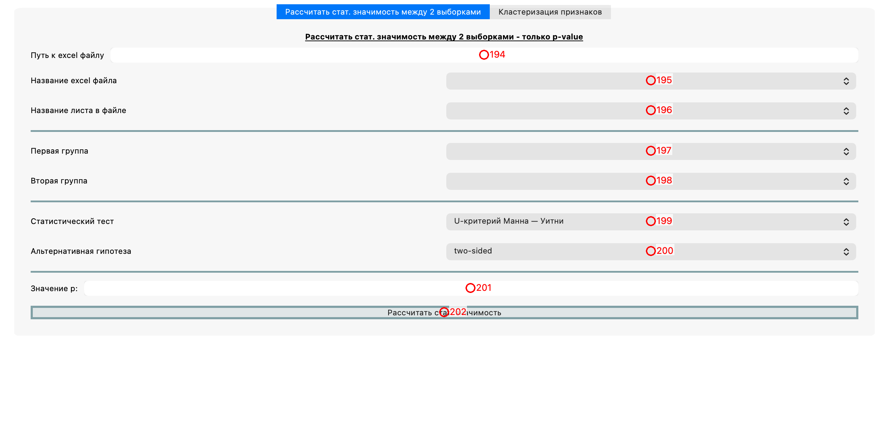
*Скриншот 4.6: вкладка — Доп. обработка*. 

<b>194. path_for_dop_stat</b> (QLineEdit) 
Путь к папке с excel файлом  

<b>195. comboBox_excel_dop_stat</b> (QComboBox) 
Название excel файла -- подставится автоматически. Надо только выбрать  

<b>196. comboBox_excel_sheet_dop_stat</b> (QComboBox) 
<html><head/><body>
Название листа в excel файле -- подставится автоматически. Надо только выбрать
</body></html>  

<b>197. comboBox_dop_stat_x</b> (QComboBox) 
Колонка №1/2 для выбора.  

<b>198. comboBox_dop_stat_y</b> (QComboBox) 
Колонка №2/2 для выбора.  

<b>199. comboBox_stat_test_dop_stat</b> (QComboBox) 
<html><head/><body>
Статистический тест для выбора.

Не используйте пермутационные тесты, если у вас много значений в колонках.
</body></html>  

<b>200. comboBox_alter_hep_dop_stat</b> (QComboBox) 
Альтернативная гипотеза.  

<b>201. p_value_dop_stat</b> (QLineEdit) 
<html><head/><body>
Выводимое значение p.
</body></html>  

<b>202. btn_dop_stat_calc</b> (QPushButton) 
Рассчитать статистическую значимость между двумя столбцами.  

#### 4.6.1. Рассчитать стат. значимость между 2 выборками

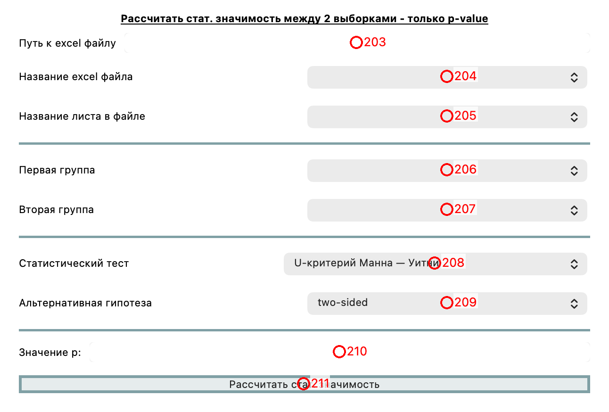
*Скриншот 4.6.1: вкладка — Рассчитать стат. значимость между 2 выборками*. 

<b>203. path_for_dop_stat</b> (QLineEdit) 
Путь к папке с excel файлом  

<b>204. comboBox_excel_dop_stat</b> (QComboBox) 
Название excel файла -- подставится автоматически. Надо только выбрать  

<b>205. comboBox_excel_sheet_dop_stat</b> (QComboBox) 
<html><head/><body>
Название листа в excel файле -- подставится автоматически. Надо только выбрать
</body></html>  

<b>206. comboBox_dop_stat_x</b> (QComboBox) 
Колонка №1/2 для выбора.  

<b>207. comboBox_dop_stat_y</b> (QComboBox) 
Колонка №2/2 для выбора.  

<b>208. comboBox_stat_test_dop_stat</b> (QComboBox) 
<html><head/><body>
Статистический тест для выбора.

Не используйте пермутационные тесты, если у вас много значений в колонках.
</body></html>  

<b>209. comboBox_alter_hep_dop_stat</b> (QComboBox) 
Альтернативная гипотеза.  

<b>210. p_value_dop_stat</b> (QLineEdit) 
<html><head/><body>
Выводимое значение p.
</body></html>  

<b>211. btn_dop_stat_calc</b> (QPushButton) 
Рассчитать статистическую значимость между двумя столбцами.  

#### 4.6.2. Кластеризация признаков

*Скриншот 4.6.2: вкладка — Кластеризация признаков*. 

<b>212. path_for_excel_cluster</b> (QLineEdit) 
Путь к папке с excel файлом для кластеризации признаков по корреляции.  

<b>213. comboBox_cluster_file</b> (QComboBox) 
Название excel файла -- подставится автоматически. Надо только выбрать  

<b>214. comboBox_cluster_excel_sheet</b> (QComboBox) 
Название листа в excel файле -- подставится автоматически. Надо только выбрать  

<b>215. spinBox_cluster_n</b> (QSpinBox) 
Кол-во класстеров для выделения.  

<b>216. comboBox_cluster_coord</b> (QComboBox) 
Координаты пространства для 2D отображения: MDS или PSA.  

<b>217. spinBox_cluster_buble_size</b> (QSpinBox) 
Размер пузырьков на графике.  

<b>218. btn_cluster_save_file</b> (QPushButton) 
Сделать кластеризацию и сохранить график.  

## 5. Доп.настройки

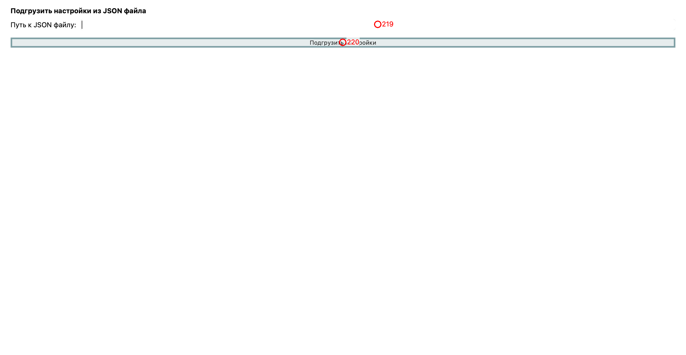
*Скриншот 5: вкладка — Доп.настройки*. Автозаполнение полей приложения из JSON файла.

<b>219. lineEdit_json_load</b> (QLineEdit) 
Полный путь к JSON файлу  

<b>220. btn_json_load</b> (QPushButton) 
<html><head/><body>
Подгрузить настройки из JSON файла. 

Это может быть полезно, если у вас есть готовый шаблон настроек для построения графиков и обработки и вам не хочется каждый раз при открытии приложения изменять настройки.

JSON файл должен быть по типу:
<pre style=" margin-top:0px; margin-bottom:0px; margin-left:0px; margin-right:0px; -qt-block-indent:0; text-indent:0px; background-color:#1f1f1f;">{</pre><pre style=" margin-top:0px; margin-bottom:0px; margin-left:0px; margin-right:0px; -qt-block-indent:0; text-indent:0px; background-color:#1f1f1f;">&quot;rheoscan_report_name_exp&quot;:&quot;ФИО&quot;,</pre><pre style=" margin-top:0px; margin-bottom:0px; margin-left:0px; margin-right:0px; -qt-block-indent:0; text-indent:0px; background-color:#1f1f1f;">&quot;rheoscan_report_parameters_dict&quot;:{</pre><pre style=" margin-top:0px; margin-bottom:0px; margin-left:0px; margin-right:0px; -qt-block-indent:0; text-indent:0px; background-color:#1f1f1f;">&quot;AAA&quot;:&quot;aaa&quot;</pre><pre style=" margin-top:0px; margin-bottom:0px; margin-left:0px; margin-right:0px; -qt-block-indent:0; text-indent:0px; background-color:#1f1f1f;">   },</pre><pre style=" margin-top:0px; margin-bottom:0px; margin-left:0px; margin-right:0px; -qt-block-indent:0; text-indent:0px; background-color:#1f1f1f;">&quot;check_approx_agg&quot;:true,</pre><pre style=" margin-top:0px; margin-bottom:0px; margin-left:0px; margin-right:0px; -qt-block-indent:0; text-indent:0px; background-color:#1f1f1f;">&quot;check_approx_deform&quot;:true</pre><pre style=" margin-top:0px; margin-bottom:0px; margin-left:0px; margin-right:0px; -qt-block-indent:0; text-indent:0px; background-color:#1f1f1f;">}</pre>
То есть ключ -- это имя объекта (в документации явно указано в подзаголовках), значение -- значение, которое в данное поле подставить.
</body></html>  

